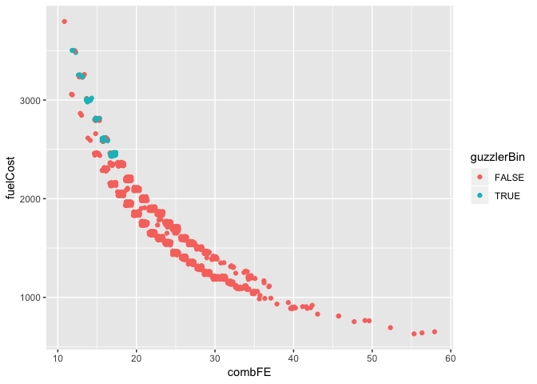

Lab 10 Replication
================
Christopher Prener, Ph.D.
(November 12, 2018)

## Introduction

This notebook replicates lab-10.

## Dependencies

This notebook requires the following packages:

``` r
# tidyverse packages
library(dplyr)
```

    ## 
    ## Attaching package: 'dplyr'

    ## The following objects are masked from 'package:stats':
    ## 
    ##     filter, lag

    ## The following objects are masked from 'package:base':
    ## 
    ##     intersect, setdiff, setequal, union

``` r
library(ggplot2)
library(readr)

# other packages
library(ggstatsplot)
library(here)
```

    ## here() starts at /Users/chris/GitHub/SOC5050/LectureRepos/lecture-11/assignments/lab-10-replication

``` r
library(knitr)
library(naniar)
library(pwr)
library(testDriveR)
```

We also use the following custom function for creating correlation
tables:

``` r
source(here("source", "corrTable.R"))
```

## Data

We’ll assign the data for the lab to a new object named `autoData`.

``` r
autoData <- auto17
```

## Part 1: Data Preparation

### Questions 1 and 2

First, we’ll create the guzzler binary variable and subset our data.

``` r
autoData %>%
  mutate(guzzlerBin = ifelse(guzzlerStr == "G", TRUE, FALSE)) %>%
  select(id, combFE, fuelCost, cyl, guzzlerBin) -> autoSub
```

We also want to write these to the `data/` folder since they will be our
analytic sample:

``` r
write_csv(autoSub, here("data", "autoAnalysis.csv"))
```

### Question 3

We want to check for missing data in the analytic sample. We can use
`naniar` for this task.

``` r
autoSub %>%
  miss_var_summary() %>%
  kable()
```

| variable   | n\_miss | pct\_miss |
| :--------- | ------: | --------: |
| id         |       0 |         0 |
| combFE     |       0 |         0 |
| fuelCost   |       0 |         0 |
| cyl        |       0 |         0 |
| guzzlerBin |       0 |         0 |

We do not have any missing data concerns with our analytic sample.

## Part 2: Creating Scatterplots

### Question 4

The following code produces a scatterplot between the variables `combFE`
and `fuelCost`.

``` r
plot <- ggplot(data = autoData) +
  geom_point(mapping = aes(x = combFE, y = fuelCost), position = "jitter")

ggsave(here("results", "p2_q4_plot.png"), plot, dpi = 300)
```

    ## Saving 7 x 5 in image

``` r
plot
```

<!-- -->

We can see a clear, if non-linear, relationship between the two
variables, which is a concern for the assumptions related to Pearson’s
\(r\). As fuel efficiency increases, the cost of fuel declines.

### Question 5

We can use the new guzzler variable to color the points of our
scatterplot.

``` r
plot <- ggplot(data = autoSub) +
  geom_point(mapping = aes(x = combFE, y = fuelCost, color = guzzlerBin), position = "jitter")

ggsave(here("results", "p2_q5_plot.png"), plot, dpi = 300)
```

    ## Saving 7 x 5 in image

``` r
plot
```

<!-- -->

This plot shows that all of the guzzler vehicles have both high fuel
cost and lost fuel efficiency.

### Question 6

Next, we’ll facet the data so that the guzzler vehicles are in one panel
and the non-guzzler vehicles are in another.

``` r
plot <- ggplot(data = autoSub) +
  geom_point(mapping = aes(x = combFE, y = fuelCost, color = guzzlerBin), position = "jitter") +
  facet_wrap(. ~ guzzlerBin)

ggsave(here("results", "p2_q6_plot.png"), plot, dpi = 300)
```

    ## Saving 7 x 5 in image

``` r
plot
```

<!-- -->

This helps us isolate the difference in pattern between guzzler and
non-guzzler vehicles.

### Question 7

We’ll go ahead and add lines for linear models as
well:

``` r
plot <- ggplot(data = autoSub, mapping = aes(x = combFE, y = fuelCost, color = guzzlerBin)) +
  geom_point(position = "jitter") +
  geom_smooth(method = "lm", mapping = aes(linetype = guzzlerBin)) +
  facet_wrap(. ~ guzzlerBin)

ggsave(here("results", "p2_q7_plot.png"), plot, dpi = 300)
```

    ## Saving 7 x 5 in image

``` r
plot
```

<!-- -->

We can see how poor of a fit the linear model is for the non-guzzler
data in this plot. A linaer relationship should absolutely not be
assumed to exist here\!

### Question 8

*Skipped*

## Part 3: Correlation in `R`

### Question 9

The following syntax creates a correlation table for the variables
`combFE`, `fuelCost`, and `cyl`.

``` r
autoSub %>%
  corrTable(coef = "pearson", listwise = TRUE, round = 3, pStar = TRUE, combFE, fuelCost, cyl) %>%
  kable()
```

|          | combFE        | fuelCost    | cyl   |
| -------- | :------------ | :---------- | :---- |
| combFE   | 1.000         |             |       |
| fuelCost | \-0.899\*\*\* | 1.000       |       |
| cyl      | \-0.723\*\*\* | 0.843\*\*\* | 1.000 |

We can also pipe this into a `.csv` file for later reference:

``` r
autoSub %>%
  corrTable(coef = "pearson", listwise = TRUE, round = 3, pStar = TRUE, combFE, fuelCost, cyl) %>%
  write_csv(here("results", "corr.csv"))
```

### Question 10

There is a strong, negative relationship between combined fuel
efficiency and fuel cost (\(r = -.899, p < .001\)). The higher the fuel
cost, the lower the fuel efficiency of the vehicle.

### Question 11

There is a strong, positive relationship between fuel cost and number of
cylinders (\(r = .843, p < .001\)). The higher the number of cylinders
in the engine, the higher the fuel cost of the vehicle.

### Question 12

There is a strong, negative relationship between combined fuel
efficiency and number of cylinders (\(r = -.723, p < .001\)). The higher
the number of cylinders in the engine, the lower the fuel efficiency of
the vehicle.

## Part 4: Sample Size Estimates

## Question 13

The following code calculates an estimated sample size for the given
parameters.

``` r
pwr.r.test(r = .89, sig.level = .05, power = .8, alternative = "two.sided")
```

    ## 
    ##      approximate correlation power calculation (arctangh transformation) 
    ## 
    ##               n = 6.483499
    ##               r = 0.89
    ##       sig.level = 0.05
    ##           power = 0.8
    ##     alternative = two.sided

We would need a sample of at least 7 people (in reality, 30) to see this
effect size (\(r=.89\)) at the given level of power (\(power = .8\))

## Question 14

The following code calculates an estimated sample size for the given
parameters.

``` r
pwr.r.test(r = .29, sig.level = .05, power = .9, alternative = "two.sided")
```

    ## 
    ##      approximate correlation power calculation (arctangh transformation) 
    ## 
    ##               n = 119.9989
    ##               r = 0.29
    ##       sig.level = 0.05
    ##           power = 0.9
    ##     alternative = two.sided

We would need a sample of at least 120 people to see this effect size
(\(r=.29\)) at the given level of power (\(power = .9\))
